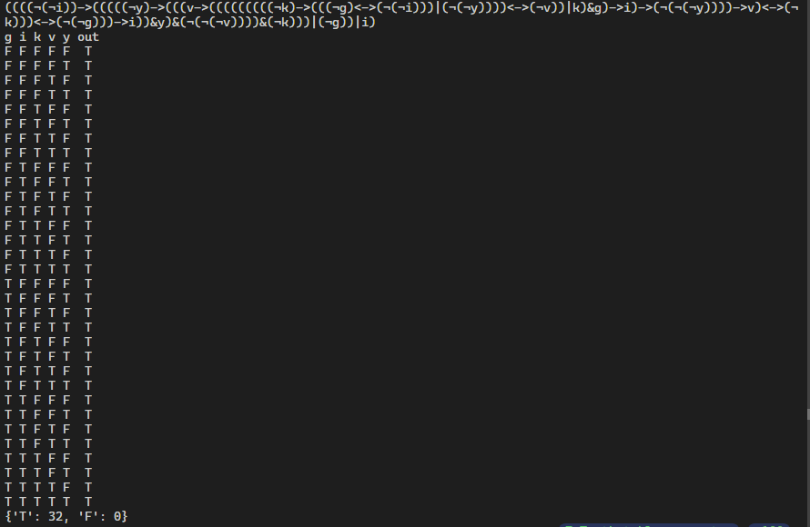

# Truth table generator
Python project that uses the [Shunting Yard Algorithm](https://en.wikipedia.org/wiki/Shunting_yard_algorithm) to parse boolean expressions and evaluates the result given a specific input.

## Features
- Parses boolean expressions
- Generates boolean expressions based on the number of variables and operations specified
- Evaluates the result based on a spcific input combination
- Outputs a table for all the true and false combinations for the input

## Example

